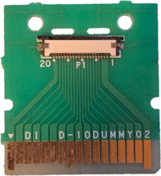
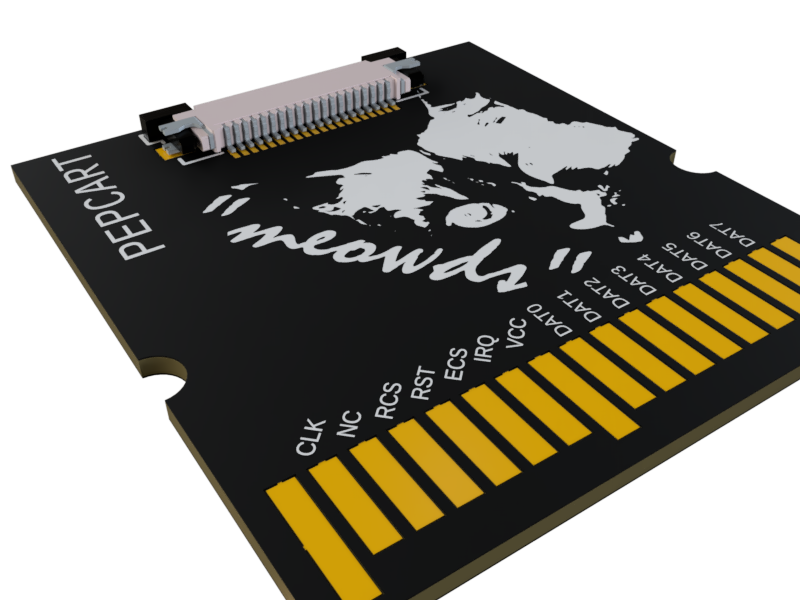
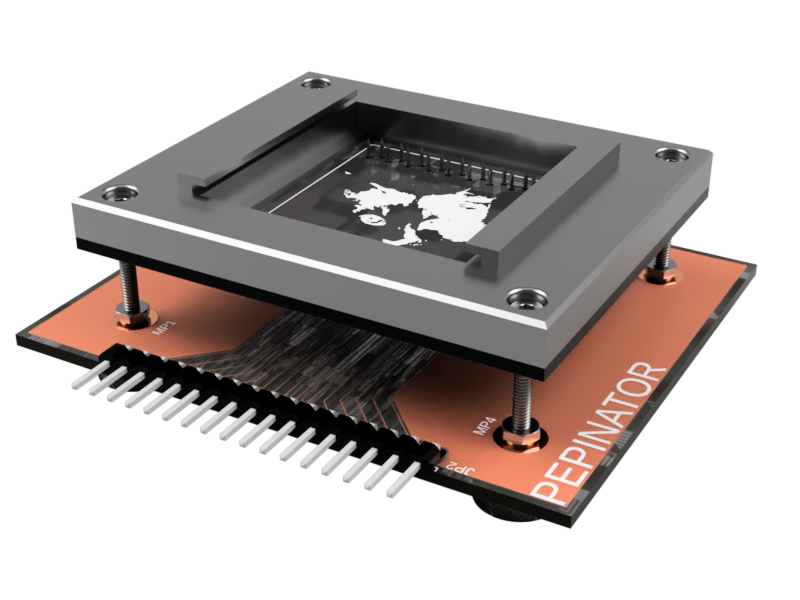
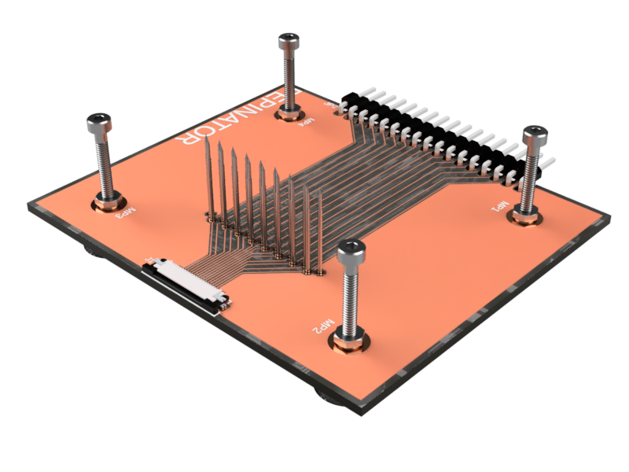

# NDS-Breakout-Board
A Nintendo DS Cartridge breakout board

## ~~Designed with KiCad~~
this was a fork of pedro's design until, threw his design out with kicad. pulled out my calipers and redesigned from scratch in Autodesk instead. 

(Thank you amcjen for teaching me EAGLE all those years ago <3)

A cartridge with various rumored official uses, known as the DUMMY or kiosk cartridge. My best guess is calling it a kiosk cartridge is a misnomer, usually sold alongside "factory kiosk units" which are known to be seen in testing jigs for the 3DS series from documentation. It was likely used in the factory and even maybe stems from an internally used design that helped prototype the original DS units, who knows.

Ideally, sniffing traffic from a live cartridge would be cool. So, using 5949T62 Spring Probes, a top board to serve as a bed for the cartridge and a bottom board to break the cartridge pins out to test points or to the FPC header. Using the FPC header with PEPCART should allow you to connect the cartridge in the bed to a live console and use the test points as a sniffing point of contact. There's a 3D printable design, needs some rework, handed it off to someone else months ago for redesign but eh no progress afaik. Pogo pin alignment should be damn near perfect with a cartridge, so if the plastic bed around it can hold it in place with something to put contact pressure down on the cartridge (even tape) then the whole thing should be okay. 

Anyways, the design is simple, provided for-free and as open source as I can make it. 

'PEPCART' essentially copies that DUMMY cartridge design. Spent a long night searching for a matching FPC connector and found the Würth Elektronik 687120183622.

